# ✴︎ tech stack ✴︎

<table>
  <tr>
    <td><strong>Languages</strong></td>
    <td>
      
      
      
      
      
      
    </td>
  </tr>
  <tr>
    <td><strong>Hosting</strong></td>
    <td>
      
      
    </td>
  </tr>
  <tr>
    <td><strong>Frameworks & Libraries</strong></td>
    <td>
      
      
      
      
      
    </td>
  </tr>
  <tr>
    <td><strong>Design</strong></td>
    <td>
      
      
    </td>
  </tr>
  <tr>
    <td><strong>Version Control</strong></td>
    <td>
      
      
    </td>
  </tr>
  <tr>
    <td><strong>Automation & Testing</strong></td>
    <td>
      
      
      
      
    </td>
  </tr>
  <tr>
    <td><strong>Tools</strong></td>
    <td>
      
    </td>
  </tr>
</table>

