I understand—you want a **complete set of all four formatting styles** (Markdown, Centered HTML, Non-clickable Picture, and Full-Width Columns) for **each** of the four templates you are testing.

This way, you can easily copy and paste the exact look you want for whichever theme ends up being the winner for your profile.

---

### 🟢 1. Classic Template
**File:** metrics-theme-classic.svg

* **Standard Markdown:**
    
* **Centered HTML:**
    

* **Non-clickable Picture:**
    <picture></picture>
* **Full-Width Columns:**
    

---

### 🟠 2. Terminal Template
**File:** metrics-theme-terminal.svg

* **Standard Markdown:**
    
* **Centered HTML:**
    

* **Non-clickable Picture:**
    <picture></picture>
* **Full-Width Columns:**
    

---

### 🔵 3. Repository Template
**File:** metrics-theme-repository.svg

* **Standard Markdown:**
    
* **Centered HTML:**
    

* **Non-clickable Picture:**
    <picture></picture>
* **Full-Width Columns:**
    

---

### 🟣 4. Community Template
**File:** metrics-theme-community.svg

* **Standard Markdown:**
    
* **Centered HTML:**
    

* **Non-clickable Picture:**
    <picture></picture>
* **Full-Width Columns:**
    

---

### 💡 Implementation Tip for @jubilancy
Since you're using the **Terminal** theme for that "personal dictionary" look, I highly recommend the **Centered HTML** style with a width="600". It makes the SVG look like a real terminal window floating in the middle of your profile!

Have you had a chance to run the workflows yet to see which one handles the **Etymonline** feed the best?